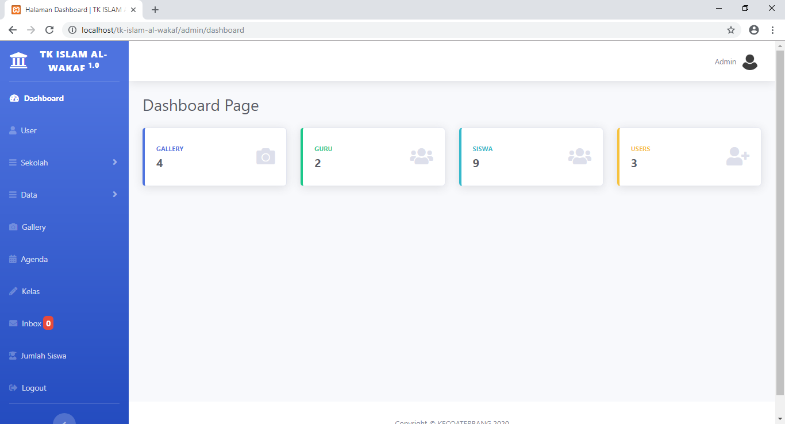
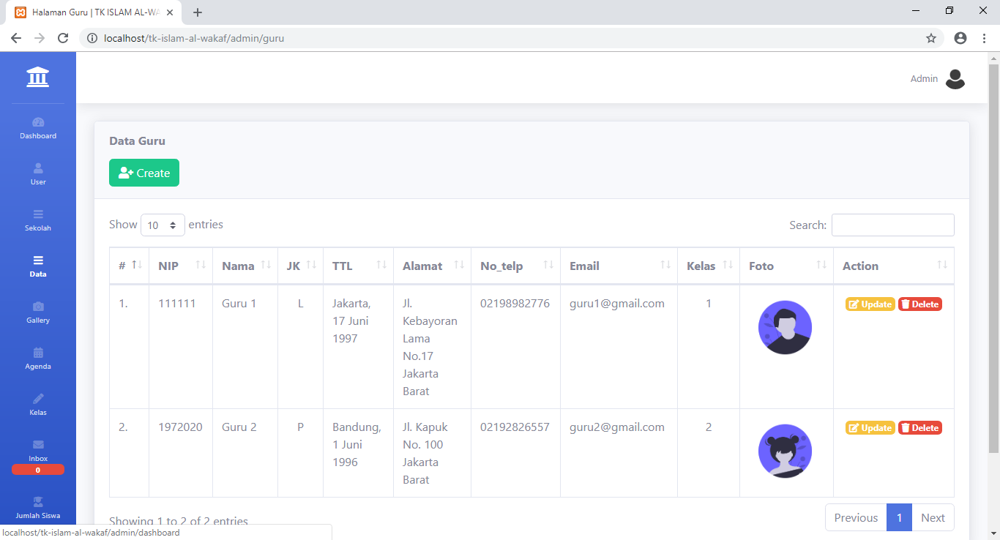
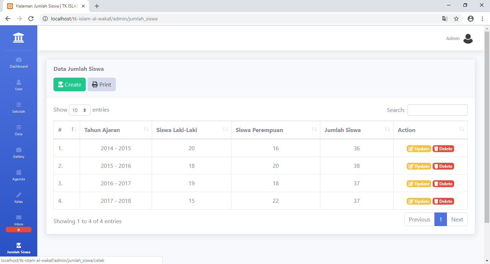
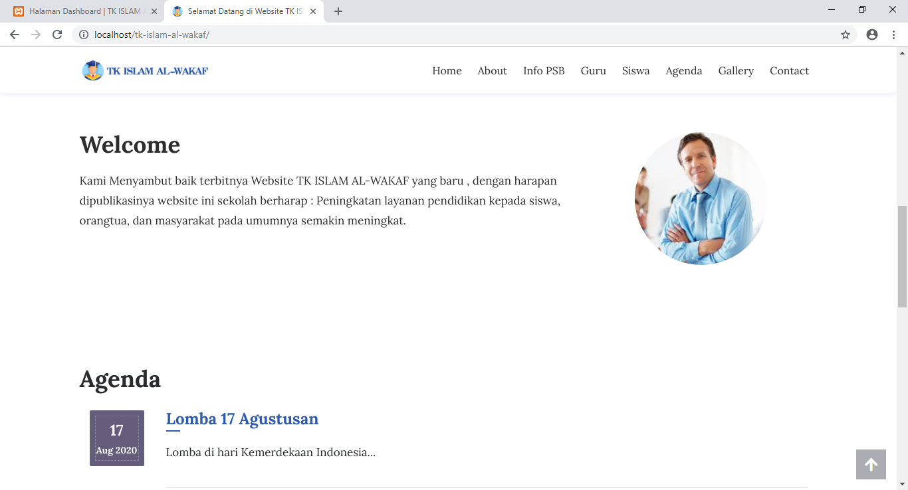
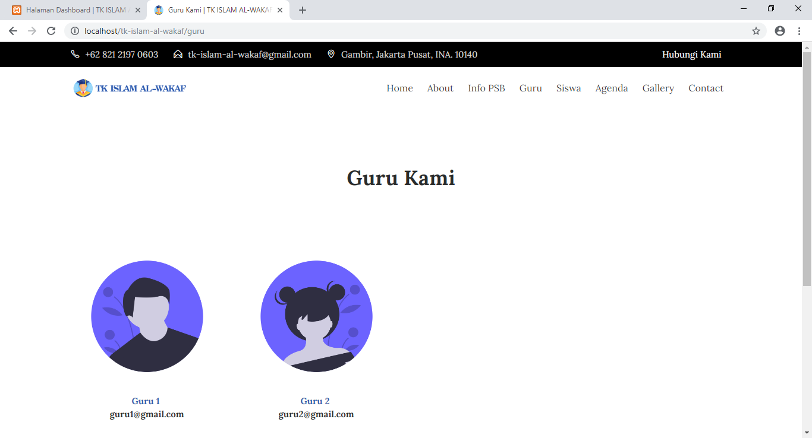

<body>

    <h6>Untuk file database / ada pertanyaan bisa email ke :</h6>
     
graykelly97@gmail.com

<h1> Sistem Informasi TK berbasis Website framework Codeigniter 3 </h1>
    <strong>Fitur-fitur</strong>
    <ol>
      <strong>Teknologi yang dipakai :</strong>
        <ul>
            <li>HTML + CSS + PHP</li>
            <li>Codeigniter 3</li>
            <li>Template SB Admin 2</li>
            <li>Bootstrap</li> 
            <li>JQuery</li>
            <li>Datatables</li>
            <li>MySQL</li> 
        </ul>
    </ol>
  <h4>Fitur-fitur :</h4>
    <ul>
        <strong>Fitur Login</strong>
        <li>Auth (1 Level) : Admin</li>
        <li>Login</li>
        <strong>Menu - Admin</strong>
        <li>Dashboard</li>
        <li>CRUD User</li>
        <li>Update Profile Sekolah ( Profile, Visi & Misi TK )</li>
        <li>Update Info PSB ( Pendaftaran Siswa Baru )</li>
        <li>CRUD Guru</li>
        <li>CRUD Siswa</li>
        <li>CRUD Gallery</li>
        <li>CRUD Agenda</li>
        <li>Read & Delete Inbox</li>
        <li>CRUD Jumlah Siswa + Cetak Laporan Jumlah Siswa</li>
    </ul>
    <h2>Screenshoots :</h2>
        
        
        
        
        
        
        
        
        
</body>
